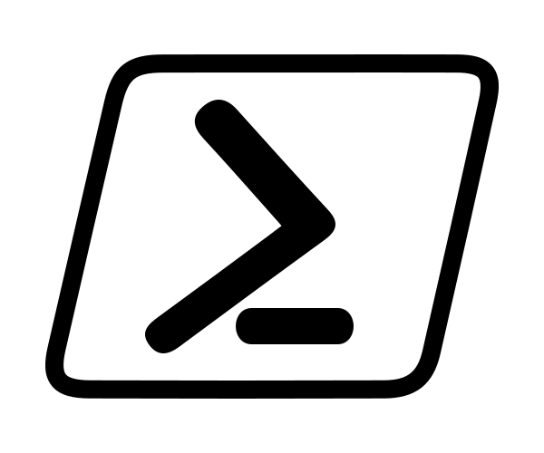

# shell_profiles

**Teleport around your machine** with the terminal with **custom links**.

Type "see" to to **see your files** in their current directory in the GUI.

Make **custom commands**, add them to the help section.

Type profiles, to **upgrade your experience**, 

**synced across all your machines**, Linux, Mac, and Windows.

Dropbox is used to sync settings across all of my work stations.

VS Code is used to modify profiles.

However, feel free to fork the project and use a syncing setup of your own.

## Installation

1. Fork shell_profiles,
2. Clone your fork into your ~/Dropbox folder.
3. Install :
   * On **Windows**, copy the **WindowsPowerShell** folder into my documents.
   * On **Mac or Linux :** 
     1. install *zshell* 
     2. copy the **.zshrc** into the home directory OR copy the line from the .zshrc into your .zshrc that is currently in your home directory.
     3. run sync_config to sync the config on your machine with the others.

